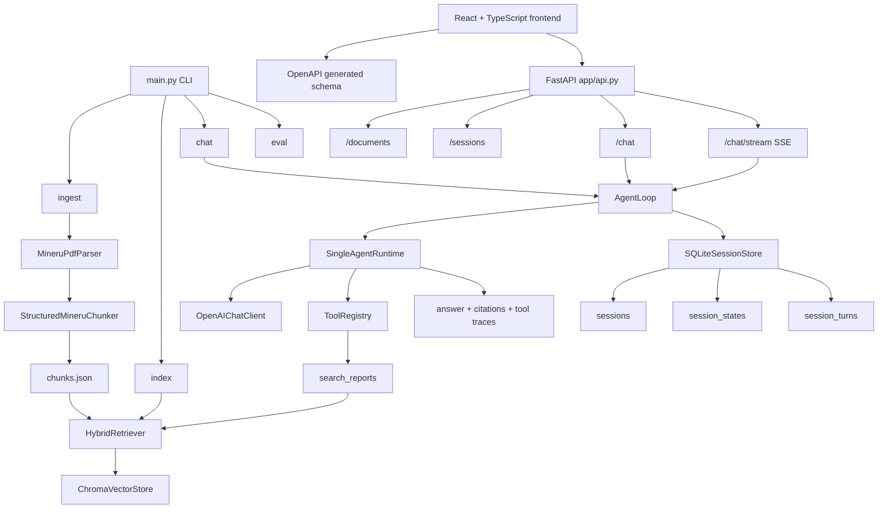

# Financial Report Agent

一个面向财报 PDF 的本地 RAG Agent 项目，当前重点是把年报解析、混合检索、工具调用、FastAPI 服务和 React 前端工作台串成一条可用链路。

项目现在包含：

- MinerU 精准 API 解析 PDF，并保留页码、章节和表格结构
- 结构化 chunk 生成，支持正文 chunk、表格 chunk、跨页续表合并
- OpenRouter embedding + ChromaDB 本地向量索引
- 关键词 + 向量的混合检索，以及查询改写
- `search_reports` 财报检索工具
- 文档管理：Web 上传 PDF、后台解析索引、任务状态轮询和文档删除
- 单 Agent runtime，支持工具调用、引用生成和工具轨迹
- FastAPI 后端，提供文档、会话、普通问答和 SSE 流式问答接口，支持会话内多文档过滤
- SQLite session 持久化，可恢复会话、消息、引用和工具轨迹
- Vite + React + TypeScript + Tailwind 前端工作台
- OpenAPI -> TypeScript schema 自动生成，前后端共用 API 契约
- unittest 后端测试和前端生产构建验证

## 当前状态

当前主链路已经从 CLI 原型推进到“本地 Web 工作台”：

- CLI 仍然可用：`main.py chat / ingest / index / eval`
- FastAPI 是后端入口：`app.api:app`
- 前端位于 `frontend/`，通过 Vite proxy 调用 `/api/*`
- 会话默认持久化到 `data/sessions.sqlite3`
- 文档上传会保存原 PDF 到 `data/raw/uploads/`，并把解析/索引产物合并到现有本地数据
- `/chat/stream` 使用 SSE 返回 `status`、`tool_result`、`answer_delta`、`final` 等事件
- 前端优先使用流式接口，并在右侧面板展示引用来源和工具轨迹

## 环境准备

```bash
uv venv .venv
source .venv/bin/activate
uv sync
```

前端依赖：

```bash
cd frontend
npm install
```

## 配置

复制 `.env.example` 为 `.env`，填写 OpenRouter key 和 MinerU token。

```env
OPENROUTER_API_KEY=your-openrouter-api-key
OPENROUTER_BASE_URL=https://openrouter.ai/api/v1
EMBEDDING_MODEL=nvidia/llama-nemotron-embed-vl-1b-v2:free
EMBEDDING_MAX_CHARS=8000
CHAT_MODEL=qwen/qwen3.6-plus:free
CHROMA_PERSIST_DIR=data/chroma
CHROMA_COLLECTION_NAME=financial-report-chunks
MINERU_API_TOKEN=your-mineru-api-token
MINERU_BASE_URL=https://mineru.net
MINERU_MODEL_VERSION=vlm
MINERU_LANGUAGE=ch
MINERU_MAX_PAGES_PER_REQUEST=200
SESSION_DB_PATH=data/sessions.sqlite3
```

`EMBEDDING_MAX_CHARS`、`MINERU_MAX_PAGES_PER_REQUEST` 和 `SESSION_DB_PATH` 可选；超长 chunk 会截断 embedding 输入但保留原文；超过 MinerU 页数限制的 PDF 会自动拆分后逐份调用 MinerU，再合并为一个文档索引；SQLite 默认使用 `data/sessions.sqlite3`。SQLite 文件属于本地运行数据，已加入 `.gitignore`。

## 数据准备

1. 准备 PDF

推荐放到 `data/raw/`。`ingest` 会优先扫描 `data/raw/`，如果目录为空，会回退扫描项目根目录下的 PDF 文件。

2. 生成 chunks

```bash
uv run python main.py ingest
```

默认产物：

- `data/processed/chunks.json`：正式索引输入
- `data/processed/mineru/<doc_id>/result.zip`：MinerU 原始结果包
- `data/processed/mineru/<doc_id>/content_list_v2.json`：主分块真相源
- `data/processed/mineru/<doc_id>/full.md`：用于人工检查的 Markdown 调试产物

超过 `MINERU_MAX_PAGES_PER_REQUEST` 的 PDF 会在 `data/processed/mineru/<doc_id>/split_pdfs/` 生成临时分片，并在 `data/processed/mineru/<doc_id>/parts/` 缓存每个分片的 MinerU 结果；最终 chunk 和索引仍属于原始 PDF 的同一个 `doc_id`。

如果想调整缓存目录、强制重新解析或修改正文 chunk 大小：

```bash
uv run python main.py ingest --artifact-dir data/processed/mineru --force-parse --max-chars 1000
```

3. 建立向量索引

```bash
uv run python main.py index
```

默认会把向量写入 `data/chroma/`。

## 启动后端

```bash
uv run uvicorn app.api:app --host 127.0.0.1 --port 8000 --reload
```

常用接口：

- `GET /health`：健康检查
- `GET /documents`：列出已索引财报
- `POST /documents/upload`：上传单个 PDF，后台解析并索引
- `GET /documents/jobs`：列出当前内存中的文档处理任务
- `GET /documents/jobs/{job_id}`：读取任务状态
- `DELETE /documents/{doc_id}`：删除该文档的索引和运行产物，保留原 PDF
- `GET /sessions`：列出会话
- `POST /sessions`：创建会话
- `GET /sessions/{session_id}`：读取会话详情和历史消息
- `PATCH /sessions/{session_id}`：更新会话标题或文档选择
- `DELETE /sessions/{session_id}`：删除会话
- `POST /chat`：普通问答，兼容非流式调用
- `POST /chat/stream`：SSE 流式问答

`/chat` 和 `/chat/stream` 请求体一致：

```json
{
  "question": "贵州茅台 2024 年营业总收入是多少？",
  "session_id": "web-demo",
  "top_k": 5,
  "doc_id": "moutai",
  "include_tool_results": true
}
```

SSE 事件类型：

- `session`：当前 session 元信息
- `status`：检索、工具调用、生成答案等阶段状态
- `tool_result`：工具执行结果摘要
- `answer_delta`：增量答案文本
- `final`：完整最终答案、引用和工具轨迹
- `error`：错误信息

服务启动后可以访问 `http://127.0.0.1:8000/docs` 查看 Swagger 文档。

## 启动前端

```bash
cd frontend
npm run dev
```

默认访问 `http://127.0.0.1:5173/`。

前端特性：

- 欢迎页进入工作台
- 文档管理面板上传 PDF、查看任务阶段、删除已索引文档
- 会话可多选文档，适合跨公司、跨报告对比分析
- 后端 session 列表加载、创建、切换、删除
- 文档选择同步到后端 session
- `/chat/stream` 流式回答逐步渲染
- 引用来源和工具轨迹面板可折叠
- Markdown 表格渲染和宽表格横向滚动
- 后端不可用时展示明确错误

## API Schema

FastAPI / Pydantic 是 API 契约来源，前端通过 `openapi-typescript` 生成类型。

后端启动后运行：

```bash
cd frontend
npm run api:schema
```

生成文件：

- `frontend/src/api/schema.ts`

该文件作为生成产物提交到仓库，方便不启动后端时也能执行前端构建。

## CLI 使用

进入命令行对话：

```bash
uv run python main.py chat
```

限定文档和召回数量：

```bash
uv run python main.py chat --top-k 5 --doc-id moutai
```

跑固定问题集评测：

```bash
uv run python main.py eval
```

评测问题集在 `data/eval/questions.json`，结果默认写到 `data/eval/results/latest.json`。

## 当前流程

```text
PDFs
-> MinerU precision API
-> content_list_v2.json / full.md / result.zip
-> StructuredMineruChunker
-> chunks.json
-> OpenRouter embeddings
-> ChromaDB
-> HybridRetriever
-> tool(search_reports)
-> SingleAgentRuntime
-> answer + citations + tool traces
-> FastAPI
-> React workspace
```

`chat` 主链路可以再理解成：

```text
User question
-> FastAPI / CLI
-> AgentLoop
-> ContextBuilder
-> SingleAgentRuntime
-> OpenAIChatClient
-> ToolRegistry
-> Retriever
-> evidence
-> answer + citations + tool traces
-> SQLiteSessionStore
```

## 架构速览



## 项目结构

- `main.py`：统一 CLI 入口，分发 `chat / ingest / index / eval`
- `app/api.py`：FastAPI 服务、session API、普通问答和 SSE 流式问答
- `app/agent.py`：`AgentLoop`、CLI/HTTP 共享的服务层、兼容 `Agent.ask()`
- `app/runtime/`：单 Agent runtime 和 OpenAI-compatible LLM client
- `app/session/`：内存 store 和 SQLite session 持久化
- `app/context/`：system prompt 和对话消息拼装
- `app/messages/`：消息模型与 OpenAI 消息适配
- `app/ingestion/`：MinerU 解析缓存、PDF 结构化分块与 ingest CLI
- `app/retrieval/`：embedding、ChromaDB、混合检索和查询改写
- `app/tables/`：表格索引和表格仓库
- `app/tools/`：工具定义与工具注册
- `app/eval.py`：固定问题集评测
- `app/domain/`：`Evidence`、`Citation`、`TurnResult` 等核心对象
- `app/shared/`：终端输出等共享能力
- `frontend/`：Vite + React + TypeScript + Tailwind 前端工作台
- `tests/`：后端 unittest 测试

## 测试与验证

后端：

```bash
uv run python -m unittest discover -s tests -v
```

前端：

```bash
cd frontend
npm run build
```

重新生成前端 API 类型：

```bash
cd frontend
npm run api:schema
```
