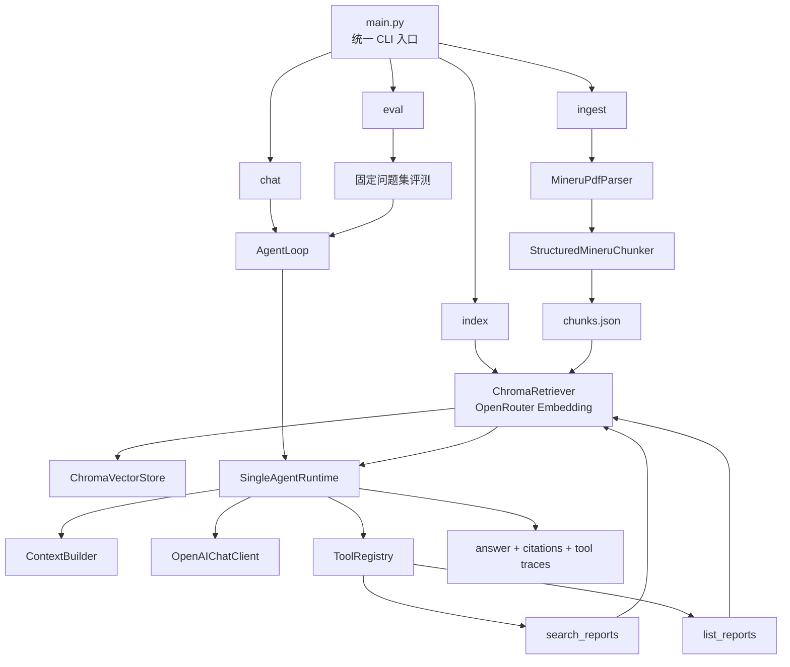

# Financial Report Agent

一个面向财报 PDF 的最小 RAG Agent 项目。

现在仓库只保留一个根入口 [`main.py`](/Users/peteryao/projects/CaibaoAgent/main.py)，真正实现统一收进 `app/` 包里，方便后续复用到 CLI、脚本调用和未来的 API 服务。

目前支持：

- 基于 MinerU 精准 API 的 PDF 结构化解析
- 基于 MinerU 结构块的自定义分块
- OpenRouter embedding 生成
- ChromaDB 本地持久化检索
- `search_reports` / `list_reports` 工具
- 基于工具调用的命令行问答
- 固定问题集评测

当前项目状态：

- 已经整理出可复用的服务层，CLI 和 `Agent.ask()` 都可以直接调用
- `chat` 主链路目前是精简后的单 agent runtime：`AgentLoop -> SingleAgentRuntime -> ToolRegistry -> Retriever`
- 还没有封装 FastAPI 应用和 HTTP 路由；当前可用入口仍然是 CLI 和 Python 调用

## 环境准备

```bash
uv venv .venv
source .venv/bin/activate
uv sync
```

## 配置

复制 `.env.example` 为 `.env`，填写你的 OpenRouter key 和 MinerU token。

```env
OPENROUTER_API_KEY=your-openrouter-api-key
OPENROUTER_BASE_URL=https://openrouter.ai/api/v1
EMBEDDING_MODEL=nvidia/llama-nemotron-embed-vl-1b-v2:free
CHAT_MODEL=qwen/qwen3.6-plus:free
CHROMA_PERSIST_DIR=data/chroma
CHROMA_COLLECTION_NAME=financial-report-chunks
MINERU_API_TOKEN=your-mineru-api-token
MINERU_BASE_URL=https://mineru.net
MINERU_MODEL_VERSION=vlm
MINERU_LANGUAGE=ch
```

## 使用方式

1. 准备 PDF

推荐放到 `data/raw/`。`ingest` 会优先扫描 `data/raw/`，如果目录为空，会回退扫描项目根目录下的 PDF 文件。

2. 生成 chunks

```bash
uv run python main.py ingest
```

默认会产出：

- [`data/processed/chunks.json`](/Users/peteryao/projects/CaibaoAgent/data/processed/chunks.json)：正式索引输入
- `data/processed/mineru/<doc_id>/result.zip`：MinerU 原始结果包
- `data/processed/mineru/<doc_id>/content_list_v2.json`：主分块真相源
- `data/processed/mineru/<doc_id>/full.md`：用于人工检查的 Markdown 调试产物

如果想调整缓存目录、强制重新解析或修改正文 chunk 大小，可以传：

```bash
uv run python main.py ingest --artifact-dir data/processed/mineru --force-parse --max-chars 1000
```

3. 建立向量索引

```bash
uv run python main.py index
```

默认会把向量写入 `data/chroma/`。

4. 进入命令行对话

```bash
uv run python main.py chat
```

如果只想在某一份文档内检索，可以传 `--doc-id`。如果想调整每次工具调用的默认召回数量，可以传 `--top-k`。

```bash
uv run python main.py chat --top-k 5 --doc-id moutai
```

5. 跑固定问题集评测

```bash
uv run python main.py eval
```

评测问题集在 [`data/eval/questions.json`](/Users/peteryao/projects/CaibaoAgent/data/eval/questions.json)，结果默认写到 [`data/eval/results/latest.json`](/Users/peteryao/projects/CaibaoAgent/data/eval/results/latest.json)。

## 当前流程

```text
PDFs -> MinerU precision API -> content_list_v2.json (+ full.md / result.zip) -> chunks.json -> OpenRouter embeddings -> ChromaDB -> search_reports -> agent loop -> answer -> eval
```

`chat` 主链路可以再理解成：

```text
User question
-> AgentLoop
-> ContextBuilder
-> SingleAgentRuntime
-> OpenAIChatClient
-> search_reports / list_reports
-> ChromaRetriever
-> evidence
-> answer + citations
```

## 架构速览



## 项目结构

- [`main.py`](/Users/peteryao/projects/CaibaoAgent/main.py)：唯一总入口，统一分发 `chat / ingest / index / eval`
- [`app/agent.py`](/Users/peteryao/projects/CaibaoAgent/app/agent.py)：聊天入口、`AgentLoop`、兼容 `Agent.ask()` 的服务层
- [`app/eval.py`](/Users/peteryao/projects/CaibaoAgent/app/eval.py)：评测逻辑与评测 CLI
- [`app/ingestion/`](/Users/peteryao/projects/CaibaoAgent/app/ingestion)：MinerU 解析缓存、PDF 结构化分块与 ingest CLI
- [`app/retrieval/`](/Users/peteryao/projects/CaibaoAgent/app/retrieval)：embedding、索引与检索
- [`app/tools/`](/Users/peteryao/projects/CaibaoAgent/app/tools)：工具定义与工具注册
- [`app/runtime/`](/Users/peteryao/projects/CaibaoAgent/app/runtime)：LLM 调用与单 agent 运行时
- [`app/context/`](/Users/peteryao/projects/CaibaoAgent/app/context)：system prompt 和对话消息拼装
- [`app/messages/`](/Users/peteryao/projects/CaibaoAgent/app/messages)：`System/User/Assistant/ToolResult` 消息模型与 OpenAI 消息适配
- [`app/session/`](/Users/peteryao/projects/CaibaoAgent/app/session)：会话状态存储
- [`app/domain/`](/Users/peteryao/projects/CaibaoAgent/app/domain)：`Evidence`、`Citation`、`TurnResult` 等核心对象
- [`app/shared/`](/Users/peteryao/projects/CaibaoAgent/app/shared)：终端输出等共享能力

## 测试

```bash
uv run python -m unittest discover -s tests -v
```
