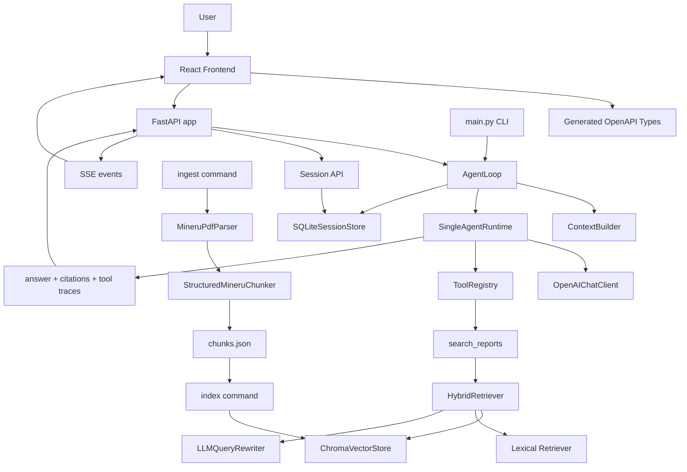

# CaibaoAgent 项目架构

## 1. 架构目标

CaibaoAgent 当前定位是单用户本地财报 RAG 工作台。项目保留 CLI 能力，同时新增 FastAPI 后端和 React 前端，让同一套 Agent runtime 可以被命令行、HTTP API 和 Web UI 复用。

核心目标：

- 财报解析结果可追溯：保留文档名、页码、章节路径和表格结构
- 检索结果可解释：返回引用和工具轨迹
- API 契约可维护：以后端 FastAPI/Pydantic 的 OpenAPI 为来源，前端生成 TypeScript 类型
- 会话可恢复：使用 SQLite 持久化 session、历史消息、引用和工具结果
- 体验可用：通过 SSE 流式输出逐步渲染回答

## 2. 总体数据流

```text
PDF
-> MinerU precision 解析
-> content_list_v2.json / full.md / result.zip
-> ParsedDocument
-> StructuredMineruChunker
-> chunks.json
-> OpenRouter Embeddings
-> ChromaDB
-> HybridRetriever
-> ToolRegistry
-> SingleAgentRuntime
-> Answer / Citations / Tool Traces
-> FastAPI
-> React Frontend
-> SQLite Session Store
```

## 3. 入口层

### CLI

- `main.py`

统一提供：

- `ingest`
- `index`
- `chat`
- `eval`

CLI 默认继续使用内存会话存储，避免命令行行为因为 Web session 持久化而突然变化。

### FastAPI

- `app/api.py`

FastAPI app 是 Web 工作台的后端入口。当前接口：

- `GET /health`
- `GET /documents`
- `POST /documents/upload`
- `GET /documents/jobs`
- `GET /documents/jobs/{job_id}`
- `DELETE /documents/{doc_id}`
- `GET /sessions`
- `POST /sessions`
- `GET /sessions/{session_id}`
- `PATCH /sessions/{session_id}`
- `DELETE /sessions/{session_id}`
- `POST /chat`
- `POST /chat/stream`

`/chat` 保留兼容的非流式 JSON 响应；`/chat/stream` 使用 SSE 返回流式事件。

### Frontend

- `frontend/src/main.tsx`
- `frontend/src/api/client.ts`
- `frontend/src/api/schema.ts`

前端是 Vite + React + TypeScript + Tailwind 工作台。它通过 Vite proxy 访问 `/api/*`，并使用生成的 OpenAPI schema 类型驱动 API client。

## 4. Ingestion

- `app/ingestion/service.py`
- `app/ingestion/parsers.py`
- `app/ingestion/chunking.py`
- `app/ingestion/types.py`

当前 parser 是 `MineruPdfParser`，会：

- 调用 MinerU API 解析 PDF
- 复用 `data/processed/mineru/<doc_id>/` 下的缓存产物
- 对超过 `MINERU_MAX_PAGES_PER_REQUEST` 的 PDF 自动拆分、逐份解析，并合并回同一个 `ParsedDocument`
- 优先读取 `content_list_v2.json`
- 兼容旧版 `*_content_list.json`
- 产出标准化 `ParsedDocument`

当前 chunker 是 `StructuredMineruChunker`，会：

- 用标题维护 `section_path`
- 聚合同一章节下的正文段落
- 对超长正文按换行和标点做受控切分
- 将表格保留为带 `table_html` 的独立 table chunk
- 尝试合并跨页续表

默认 ingest 产物：

- `data/processed/chunks.json`
- `data/processed/mineru/<doc_id>/result.zip`
- `data/processed/mineru/<doc_id>/content_list_v2.json`
- `data/processed/mineru/<doc_id>/full.md`
- 大文档额外包含 `data/processed/mineru/<doc_id>/split_pdfs/` 和 `data/processed/mineru/<doc_id>/parts/`

Web 文档管理由 `app/documents/service.py` 复用同一套 parser/chunker/retriever。上传的 PDF 保存在 `data/raw/uploads/`，后台任务会为单个 PDF 生成 chunks、合并到 `data/processed/chunks.json`，并写入 Chroma。删除文档时会移除对应 chunks、Chroma 向量和 MinerU 缓存，但保留原 PDF。

会话选择支持多文档：API 兼容旧的 `doc_id` 字段，同时使用 `doc_ids` 表示当前会话的文档集合。检索工具会把多选转换为 Chroma metadata `$in` 过滤，Agent 只能在当前选择的文档集合内取证。

## 5. Retrieval

- `app/retrieval/retriever.py`
- `app/retrieval/hybrid.py`
- `app/retrieval/vector_store.py`

检索层包括：

- `ChromaRetriever`：负责 embedding、向量索引和向量检索
- `HybridRetriever`：组合向量检索、关键词检索和查询改写
- `LLMQueryRewriter`：使用模型生成更适合财报检索的查询变体

输出会保留：

- `doc_id`
- `doc_name`
- `page` / `page_start` / `page_end`
- `section_path`
- `chunk_type`
- `score`

## 6. Tools

- `app/tools/base.py`
- `app/tools/financial_reports.py`

当前默认工具：

- `search_reports`：基于检索层返回文本或表格证据

工具统一由 `ToolRegistry` 暴露给模型，并在 runtime 中记录为 `ToolTrace`。

## 7. Agent Runtime

- `app/agent.py`
- `app/runtime/single_agent.py`
- `app/runtime/openai_client.py`
- `app/context/builder.py`
- `app/messages/models.py`

运行时链路：

```text
question
-> AgentLoop
-> ContextBuilder
-> SingleAgentRuntime
-> OpenAIChatClient
-> tool calls
-> ToolRegistry.execute()
-> ToolResultMessage
-> final answer
-> citations + tool traces
```

`SingleAgentRuntime` 负责：

- 读取会话上下文
- 构建消息列表
- 调用 LLM
- 执行工具调用
- 将工具结果反馈给模型
- 生成最终回答
- 从工具输出中提取引用
- 保存更新后的 `ConversationState`

`OpenAIChatClient` 支持：

- 非流式 `generate`
- 流式 `generate_stream`
- OpenAI-compatible tool call 消息适配

## 8. Session 持久化

- `app/session/store.py`

会话存储分两类：

- `InMemorySessionStore`：CLI 默认使用
- `SQLiteSessionStore`：FastAPI 默认使用

SQLite 默认路径：

```text
data/sessions.sqlite3
```

可通过环境变量覆盖：

```env
SESSION_DB_PATH=/custom/path/sessions.sqlite3
```

数据表：

- `sessions`：会话摘要，包含 `id`、`title`、`doc_id`、`created_at`、`updated_at`
- `session_states`：完整 `ConversationState` JSON，用于 runtime 上下文恢复
- `session_turns`：用户问题、助手回答、引用 JSON、工具结果 JSON，用于前端历史消息恢复

`POST /chat` 和 `/chat/stream` 都会在 SQLite 中记录当前 turn。

## 9. API Schema

FastAPI/Pydantic 是契约来源，前端不再维护手写响应类型。

生成命令：

```bash
cd frontend
npm run api:schema
```

输出：

```text
frontend/src/api/schema.ts
```

前端 API client：

```text
frontend/src/api/client.ts
```

它封装：

- documents API
- sessions API
- SSE streaming parser
- 由 `components["schemas"]` 派生的 TypeScript 类型

## 10. SSE 流式输出

接口：

```text
POST /chat/stream
```

请求体沿用 `ChatRequest`。

事件格式：

- `session`：会话 ID
- `status`：当前阶段，例如生成工具计划、调用工具、生成最终答案
- `tool_result`：工具执行结果
- `answer_delta`：增量文本
- `final`：完整 `ChatResponse`
- `error`：错误信息

第一版设计中，工具调用仍是同步执行；最终答案通过 LLM streaming 逐步返回。前端收到 `answer_delta` 后持续追加 assistant message，收到 `tool_result` 和 `final` 后刷新右侧证据面板。

## 11. Frontend 工作台

前端布局：

- 欢迎页
- 左侧 session 列表
- 中间聊天工作区
- 顶部文档选择
- 底部输入框
- 右侧引用与检索路径面板

当前交互：

- 启动后加载 `/api/documents` 和 `/api/sessions`
- 文档管理面板支持单 PDF 上传、任务状态轮询和删除已索引文档
- 如果没有 session，会自动创建一个新 session
- 新建、切换、删除 session 都走后端 API
- 文档选择通过 `PATCH /sessions/{session_id}` 持久化
- 发送消息优先走 `/api/chat/stream`
- 后端不可用时显示明确错误
- Markdown 表格会被渲染成 HTML table，并支持横向滚动

## 12. Eval

- `app/eval.py`
- `data/eval/questions.json`

评测会读取固定问题集，调用当前 agent 产出答案，再让模型按标准答案和引用页码做 JSON 判分。

结果默认写入：

```text
data/eval/results/latest.json
```

## 13. Mermaid 架构图



## 14. 现阶段约束

- 当前项目仍按单用户本地应用设计，暂不包含用户账号、权限和多租户隔离。
- SQLite 足够支撑本地 session；如果未来部署成多人服务，需要迁移到 Postgres 或同类数据库。
- `ingest` 和 `index` 仍然是两个独立步骤；重新解析 PDF 后，需要重新执行 `index`。
- `data/chroma/`、`data/processed/`、`data/sessions.sqlite3` 都是本地运行数据，不应提交到仓库。
- 流式输出第一版不包含复杂取消、中断恢复、并发队列或多用户隔离。
- 前端当前是工作台原型，核心 API 已接入，但设置页、文档管理和更完整的错误恢复还可以继续增强。
