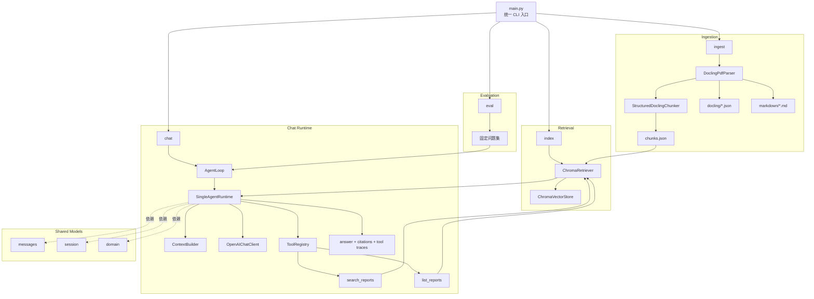

# CaibaoAgent 项目架构

## 1. 项目目标

CaibaoAgent 是一个面向财报 PDF 的轻量 RAG Agent。当前项目重点不是做一个很重的通用框架，而是围绕“财报解析、结构化分块、向量检索、问答闭环”构建一条清晰、可替换、可持续演进的链路。

当前核心目标有三点：

1. 把财报 PDF 转成适合检索的结构化 chunk
2. 用 embedding + 向量库建立稳定的召回能力
3. 通过工具调用让命令行 Agent 能基于检索结果回答问题

## 2. 整体架构

当前主流程如下：

```text
PDF
-> Docling 解析
-> Docling JSON（lossless 真相源）
-> Markdown（调试产物，可选）
-> Structured Chunking
-> chunks.json
-> OpenRouter Embeddings
-> ChromaDB
-> search_reports / list_reports
-> Agent Loop
-> Answer / Eval
```

这里有两个设计原则：

1. `Docling JSON` 是正式真相源，Markdown 只是辅助检查产物
2. ingestion、retrieval、agent 三层保持解耦，后续可以独立替换解析器、分块器、embedding 模型或向量库

当前还保留一个很明确的边界：

- 项目已经有可复用的服务层，但还没有对外封装 FastAPI 应用
- 对外使用方式目前是 CLI 和 Python 代码直接调用 `Agent` / `AgentLoop`

### 2.1 当前架构图



## 3. 模块划分

### 3.1 入口层

- [`main.py`](/Users/peteryao/projects/CaibaoAgent/main.py)

项目只保留一个根入口，统一分发四个子命令：

- `ingest`
- `index`
- `chat`
- `eval`

这样做的好处是 CLI 体验统一，同时业务实现都落在 `app/` 下，方便未来复用。

### 3.2 Ingestion 层

- [`app/ingestion/service.py`](/Users/peteryao/projects/CaibaoAgent/app/ingestion/service.py)
- [`app/ingestion/parsers.py`](/Users/peteryao/projects/CaibaoAgent/app/ingestion/parsers.py)
- [`app/ingestion/chunking.py`](/Users/peteryao/projects/CaibaoAgent/app/ingestion/chunking.py)
- [`app/ingestion/types.py`](/Users/peteryao/projects/CaibaoAgent/app/ingestion/types.py)

这一层负责“从 PDF 到 chunks.json”的全过程，已经拆成三部分：

1. `DocumentParser`
   负责把 PDF 解析成标准化 `ParsedDocument`

2. `ChunkStrategy`
   负责把 `ParsedDocument` 转成 chunk 列表

3. `IngestionService`
   负责串联 parser 和 chunker，并写出中间产物与最终产物

#### Parser

默认解析器是 `DoclingPdfParser`。

它负责：

- 调用 Docling 解析 PDF
- 导出 `raw_doc` JSON
- 可选导出 Markdown
- 从 Docling 原始结构中提取标准化元素列表 `elements`

`ParsedDocument` 目前包含：

- `doc_id`
- `doc_name`
- `source_path`
- `raw_doc`
- `elements`
- `markdown`
- `page_map`

#### Chunker

默认分块器是 `StructuredDoclingChunker`。

它不是对 Markdown 或纯文本做字符硬切，而是优先基于结构元素做分块：

- 标题元素更新 `section_path`
- 正文段落在同一 section 下聚合
- 表格作为独立结构单元处理
- section 过长时再做受控切分

当前 chunk 会尽量保留检索和引用需要的信息：

- `chunk_id`
- `doc_id`
- `doc_name`
- `source_path`
- `page`
- `page_start`
- `page_end`
- `section_path`
- `chunk_type`
- `text`
- `provenance`
- `bbox_refs`
- `element_ids`

#### 产物

默认 ingest 会写三类产物：

- `data/processed/chunks.json`
- `data/processed/docling/*.json`
- `data/processed/markdown/*.md`

其中：

- `docling/*.json` 是正式可复用真相源
- `markdown/*.md` 用于人工检查解析质量
- `chunks.json` 是 index 阶段的直接输入

### 3.3 Retrieval 层

- [`app/retrieval/retriever.py`](/Users/peteryao/projects/CaibaoAgent/app/retrieval/retriever.py)
- [`app/retrieval/vector_store.py`](/Users/peteryao/projects/CaibaoAgent/app/retrieval/vector_store.py)

这一层负责“从 chunks 到可搜索知识库”。

#### Retriever

`ChromaRetriever` 主要职责：

- 调用 OpenRouter embedding 接口
- 对 chunk 做分批 embedding
- 调用向量库 upsert
- 把查询语句 embedding 后交给向量库搜索

当前 embedding 采用批处理，而不是一个 chunk 一次请求。这样可以兼顾吞吐和稳定性，避免单次请求过大导致响应异常。

#### Vector Store

默认向量库实现是 `ChromaVectorStore`。

它负责：

- 持久化 embedding 到本地 `data/chroma/`
- 根据 embedding 召回相似 chunk
- 列出已索引文档

目前 Chroma metadata 里保留的仍是检索主路径需要的核心字段，例如：

- `doc_id`
- `doc_name`
- `source_path`
- `page`

### 3.4 Tools 层

- [`app/tools/financial_reports.py`](/Users/peteryao/projects/CaibaoAgent/app/tools/financial_reports.py)

工具层把 retrieval 能力封装成给 Agent 使用的工具：

- `search_reports`
- `list_reports`

这一层是 Agent 和检索层之间的稳定边界。Agent 不直接访问向量库，只通过工具能力拿证据。

### 3.5 Agent / Runtime 层

- [`app/agent.py`](/Users/peteryao/projects/CaibaoAgent/app/agent.py)
- [`app/runtime/`](/Users/peteryao/projects/CaibaoAgent/app/runtime)
- [`app/context/`](/Users/peteryao/projects/CaibaoAgent/app/context)
- [`app/messages/`](/Users/peteryao/projects/CaibaoAgent/app/messages)
- [`app/session/`](/Users/peteryao/projects/CaibaoAgent/app/session)

这一层负责：

- 组织消息上下文
- 运行工具调用循环
- 保存会话状态
- 把工具结果注入上下文
- 生成最终回答

它的职责是“调度和对话”，不是“理解 PDF 结构”或“直接做检索实现”。

当前这层在实现上已经收敛成比较直接的主链路：

- `AgentLoop` 负责组装依赖、维护默认 `top_k` / `doc_id`，并在每轮调用时把默认检索参数补给 `search_reports`
- `ContextBuilder` 只负责一件事：把 system prompt 和新一轮用户消息拼进上下文
- `SingleAgentRuntime` 只负责消息循环、工具执行、会话保存和 citation 提取
- `AssistantMessage` 直接承载模型产生的 `tool_calls`
- `ToolResultMessage` 负责把工具输出回填给模型

这样 `chat` 主流程可以直接读成：

```text
组消息 -> 调模型 -> 执行工具 -> 回填证据 -> 最终回答
```

### 3.6 Eval 层

- [`app/eval.py`](/Users/peteryao/projects/CaibaoAgent/app/eval.py)
- [`data/eval/questions.json`](/Users/peteryao/projects/CaibaoAgent/data/eval/questions.json)

评测层负责固定问题集验证，用来观察 ingestion、retrieval、agent 这几层组合之后的最终效果。

## 4. 当前数据流

### 4.1 Ingest

```text
main.py ingest
-> discover PDF files
-> DoclingPdfParser.parse(pdf)
-> ParsedDocument
-> IngestionService 写 docling json / markdown
-> StructuredDoclingChunker.chunk(document)
-> chunks.json
```

### 4.2 Index

```text
main.py index
-> load chunks.json
-> batched embed via OpenRouter
-> ChromaVectorStore.upsert_documents(...)
```

### 4.3 Chat

```text
main.py chat
-> user question
-> AgentLoop.run_turn(...)
-> ContextBuilder.build(...)
-> SingleAgentRuntime
-> OpenAIChatClient.generate(...)
-> search_reports / list_reports
-> retriever.search(...)
-> Chroma similarity search
-> ToolResultMessage
-> final answer + citations
```

## 5. 当前设计的优点

### 5.1 结构保真优先

相比早期“`pypdf` 抽文本 + 按字符切块”，现在的链路保留了更多结构与 provenance 信息，更适合财报这种章节和表格密集的文档。

### 5.2 模块化边界更清晰

Parser、Chunker、Service 已经拆开，后续可以独立替换：

- 解析器
- 分块策略
- 中间产物导出形式
- 索引策略

同时，问答主链路也已经去掉了一些过薄的包装层，保留了更稳定的大边界：

- `agent`
- `runtime`
- `tools`
- `retrieval`

### 5.3 调试路径更明确

现在可以比较清晰地区分问题出在哪一层：

- Docling JSON 有问题：解析层问题
- Markdown 看起来不对：导出或人工检查问题
- JSON 正常但 chunk 不理想：分块策略问题
- chunk 正常但问答差：retrieval 或 agent 问题

## 6. 当前限制与后续优化方向

### 6.1 Ingest 偏慢

当前最慢的是 Docling 解析完整财报，而不是 chunker 本身。后续可以考虑：

- 复用已有 `docling/*.json`
- 将 “parse” 与 “chunk” 拆成两个命令
- 增量处理未变化 PDF
- 允许单文件或限页调试

### 6.2 Index 重建策略还不够显式

当前 Chroma 使用 upsert，如果 chunk_id 变化，旧 embedding 可能残留。后续建议补：

- `--rebuild`
- 或清空 collection 后重建

### 6.3 Chunk 策略仍可继续细化

当前的 `StructuredDoclingChunker` 已经比硬切块好很多，但还可以继续提升：

- 更好的标题层级识别
- 更精细的表格序列化
- 章节摘要 / 父子块策略
- 针对财报目录页、附注、脚注做差异化处理

### 6.4 API 层还未落地

当前仓库虽然已经把服务层职责拆清楚了，但还没有真正提供：

- FastAPI app 入口
- HTTP 路由
- 请求 / 响应 schema
- Web 服务启动方式

这意味着现在的“后端能力”更准确地说是“可复用的 Python 服务层”，而不是完整的 HTTP API 服务。

## 7. 推荐理解顺序

如果要快速理解项目，建议按这个顺序读代码：

1. [`main.py`](/Users/peteryao/projects/CaibaoAgent/main.py)
2. [`app/ingestion/service.py`](/Users/peteryao/projects/CaibaoAgent/app/ingestion/service.py)
3. [`app/ingestion/parsers.py`](/Users/peteryao/projects/CaibaoAgent/app/ingestion/parsers.py)
4. [`app/ingestion/chunking.py`](/Users/peteryao/projects/CaibaoAgent/app/ingestion/chunking.py)
5. [`app/retrieval/retriever.py`](/Users/peteryao/projects/CaibaoAgent/app/retrieval/retriever.py)
6. [`app/retrieval/vector_store.py`](/Users/peteryao/projects/CaibaoAgent/app/retrieval/vector_store.py)
7. [`app/agent.py`](/Users/peteryao/projects/CaibaoAgent/app/agent.py)

这样会比较容易先建立主链路，再理解每层细节。
